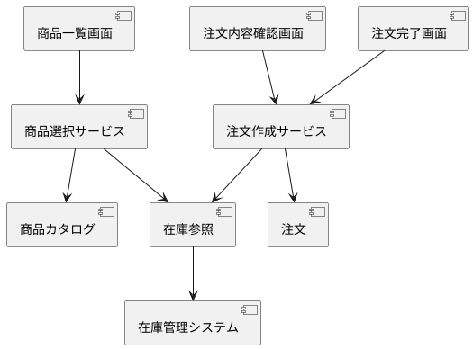

# Component Dependency：最小購入フロー

## 依存関係

| 依存元 | 依存先 | 理由 |
|---|---|---|
| 商品一覧画面 | 商品選択サービス | 商品一覧と在庫状況、選択可否を取得するため |
| 注文内容確認画面 | 注文作成サービス | 注文内容の組み立てと注文の作成を依頼するため |
| 注文完了画面 | 注文作成サービス | 作成結果（注文の識別子）を受け取って表示するため |
| 商品選択サービス | 商品カタログ | 商品情報を取得するため |
| 商品選択サービス | 在庫参照 | 商品一覧に表示する在庫状況を取得するため |
| 注文作成サービス | 注文 | 注文の作成と記録を行うため |
| 注文作成サービス | 在庫参照 | 注文作成の判断に作成時点の在庫を確認するため |
| 在庫参照 | 在庫管理システム（EXT001） | 在庫情報の参照元にするため。連携手段は未確認 |

## 依存の方向

画面コンポーネントはサービス層だけに依存し、ドメイン側コンポーネント（商品カタログ、在庫参照、注文）を直接呼ばない。
在庫管理システムへの依存は在庫参照コンポーネントだけに閉じる。

