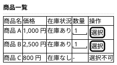
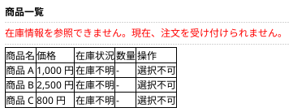
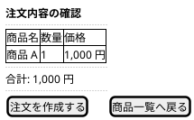
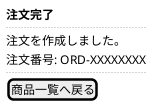

# Mockups：最小購入フロー

Ideation の rough mockups（wireframes.md、user-flow.md）を、要求とストーリーに対応づけて精緻化した。
数量の指定は商品一覧の選択時に行い、注文内容の確認画面では変更しない（最小構成）。

## 商品一覧画面（通常時）

対応する要求とストーリー: R001、R002、R005 / S001、S002、S005

商品ごとに商品名、価格、在庫状況、数量入力、選択操作を表示する。
在庫状況は在庫管理システムから参照した在庫情報を反映し、在庫のない商品は選択操作を無効にする。
数量は既定値 1 の数値入力で、1 以上の整数だけを受け付ける。

## 商品一覧画面（在庫参照不能時）

対応する要求とストーリー: R006 / S006

在庫管理システムから在庫情報を参照できない場合、画面上部に参照できないことを通知し、すべての商品の選択操作を無効にする。

## 注文内容の確認画面

対応する要求とストーリー: R003 / S003

選択した商品の商品名、数量、価格と合計金額を表示する。
注文を作成せずに商品一覧へ戻れる。

## 注文完了画面

対応する要求とストーリー: R004 / S004

注文の作成結果として注文番号を表示する。

注文番号の形式は未確認であり、表示例は仮置きである。
