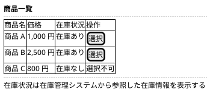
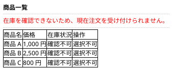
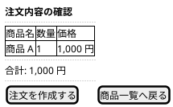
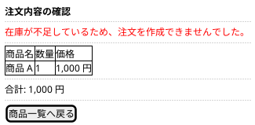
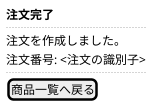

# Mockups：最小購入フロー

Ideation の wireframes を、要求とストーリーに対応づけて精緻化した詳細モックである。
数量は 1 固定（D006）のため、数量の入力要素は置かない。

## 商品一覧画面

対応する要求とストーリー: R001、R002、S001、S002

## 商品一覧画面（在庫参照不能時）

対応する要求とストーリー: R006、S006

在庫管理システムから在庫情報を参照できない場合の表示である。
在庫を確認できない旨を表示し、すべての商品を選択できないようにする。

## 注文内容の確認画面

対応する要求とストーリー: R003、S003

## 注文内容の確認画面（注文を作成できない場合）

対応する要求とストーリー: R005、R006、S005、S006

注文作成時に在庫が不足する場合、または在庫情報を参照できない場合の表示である。
注文は作成されず、理由を表示する。

在庫情報を参照できない場合は、メッセージを「在庫を確認できないため、注文を作成できませんでした。」に置き換える。

## 注文完了画面

対応する要求とストーリー: R004、S004

