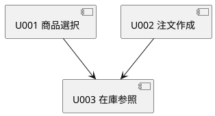

# Unit Dependencies：最小購入フロー

## 依存 DAG

| 依存元 | 依存先 | 理由 |
|---|---|---|
| U001 商品選択 | U003 在庫参照 | 商品一覧の在庫状況の表示と選択可否の判断に、在庫情報の参照が必要なため |
| U002 注文作成 | U003 在庫参照 | 注文作成の判断に、作成時点の在庫確認が必要なため |

依存は非循環にする。

U001 と U002 の間に依存はない。
画面遷移（商品選択から注文内容の確認へ進む）は購入者の操作の流れであり、Unit の実装依存ではない。
