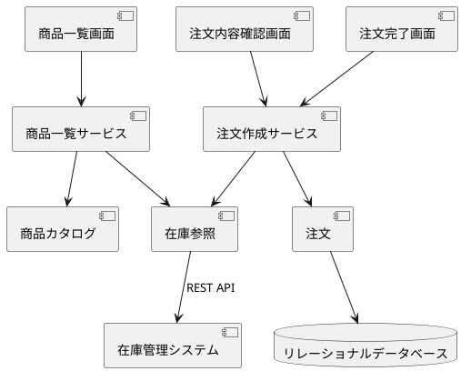

# Component Dependency：260703-minimum-purchase-flow

## 依存関係

| 依存元 | 依存先 | 理由 |
|---|---|---|
| 商品一覧画面 | 商品一覧サービス | 在庫状況つきの商品一覧を取得するため |
| 注文内容確認画面 | 注文作成サービス | 注文の作成を指示し、在庫不足と在庫参照失敗の結果を表示するため |
| 注文完了画面 | 注文作成サービス | 作成した注文の注文番号を表示するため |
| 商品一覧サービス | 商品カタログ | 販売対象の商品情報を取得するため |
| 商品一覧サービス | 在庫参照 | 商品ごとの在庫状況を取得するため |
| 注文作成サービス | 在庫参照 | 注文作成時に在庫を確認するため |
| 注文作成サービス | 注文 | 注文の組み立て、記録、照会を行うため |
| 在庫参照 | 在庫管理システム（EXT001） | 在庫情報を REST API で参照するため（外部システム） |
| 注文 | リレーショナルデータベース | 注文を記録し、注文番号で照会するため |

依存は UI からサービス層、サービス層からドメインと外部連携への一方向だけにする。
循環依存はない。
