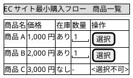
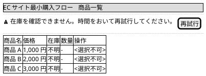
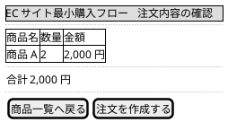
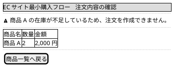
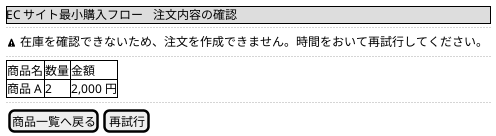
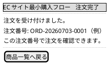

# Mockups：260703-minimum-purchase-flow

rough mockups（ideation/rough-mockups/wireframes.md）を、要求とストーリーに対応づけて精緻化した詳細モックである。
数量指定（GD004）と在庫参照失敗時の振る舞い（GD001）を反映した。

## 商品一覧画面

対応する要求とストーリー: R001, R002, R006 / S001, S002

商品ごとに在庫状況を表示し、在庫がある商品だけを数量つきで選択できる。
数量の既定値は 1 であり、1 以上の整数だけを受け付ける。

### 在庫参照に失敗した場合の表示（R008 / S006）

在庫を確認できない旨を表示し、商品の選択を無効にして再試行を促す。

## 注文内容確認画面

対応する要求とストーリー: R003, R007, R008 / S003, S005, S006

選択した商品、数量、金額、合計金額を表示し、注文を作成するかどうかを確定する。

### 在庫が不足していた場合の表示（R007 / S005）

注文は作成されず、在庫が不足している旨を表示する。

### 在庫参照に失敗した場合の表示（R008 / S006）

注文は作成されず、在庫を確認できない旨と再試行の案内を表示する。

## 注文完了画面

対応する要求とストーリー: R004, R005 / S004

作成した注文の注文番号を表示し、注文が記録されたことを購入者に伝える。

注文番号の形式は例示であり、確定は Construction の Functional Design が扱う。
