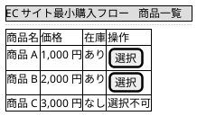
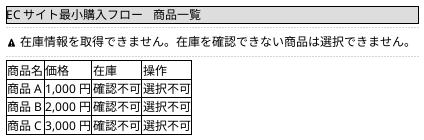
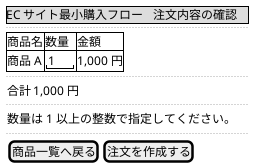
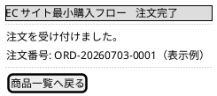

# Mockups：260703-minimum-purchase-flow

## 商品一覧画面

対応する要求とストーリー: R001、R002、R005、R006、S001、S002、S005

商品ごとに商品名、価格、在庫状況を表示する。
在庫がある商品だけに選択操作を表示し、在庫がない商品は選択不可として表示する。
在庫管理システムから在庫情報を参照できない場合は、参照できない旨の案内を表示し、対象商品を選択不可にする。

在庫情報を参照できない場合の表示は次にする。

## 注文内容確認画面

対応する要求とストーリー: R003、S003

選択した商品の商品名、数量、金額、合計金額を表示する。
数量は 1 以上の整数を指定でき、既定値は 1 にする。
数量を変更すると、金額と合計金額が数量に応じて更新される。

## 注文完了画面

対応する要求とストーリー: R004、S004

作成した注文の識別子を表示し、注文がリレーショナルデータベースに記録されたことを購入者に伝える。

注文の識別子の形式は例示であり、確定は Construction の Functional Design が扱う。
