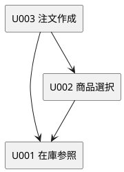

# Unit Dependencies：260703-minimum-purchase-flow

## 依存 DAG

| 依存元 | 依存先 | 理由 |
|---|---|---|
| U002 商品選択 | U001 在庫参照 | 商品一覧サービスが在庫参照を使い、商品ごとの在庫状況を表示するため（R006） |
| U003 注文作成 | U001 在庫参照 | 注文作成サービスが在庫参照を使い、注文作成時に在庫を確認するため（R007, R008） |
| U003 注文作成 | U002 商品選択 | 注文対象の商品と数量は商品選択の結果であり、商品カタログの商品情報（商品名、価格）を注文内容の表示に使うため |

依存は非循環である。
